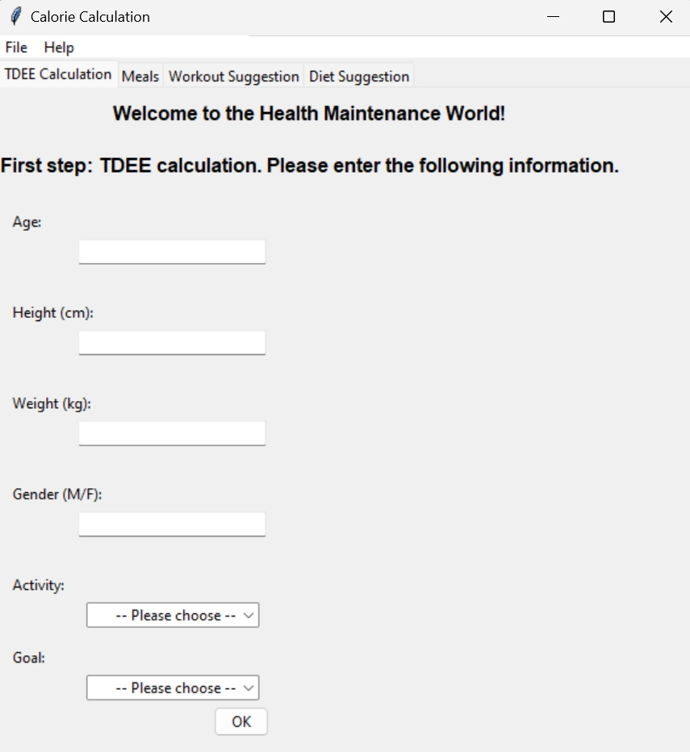
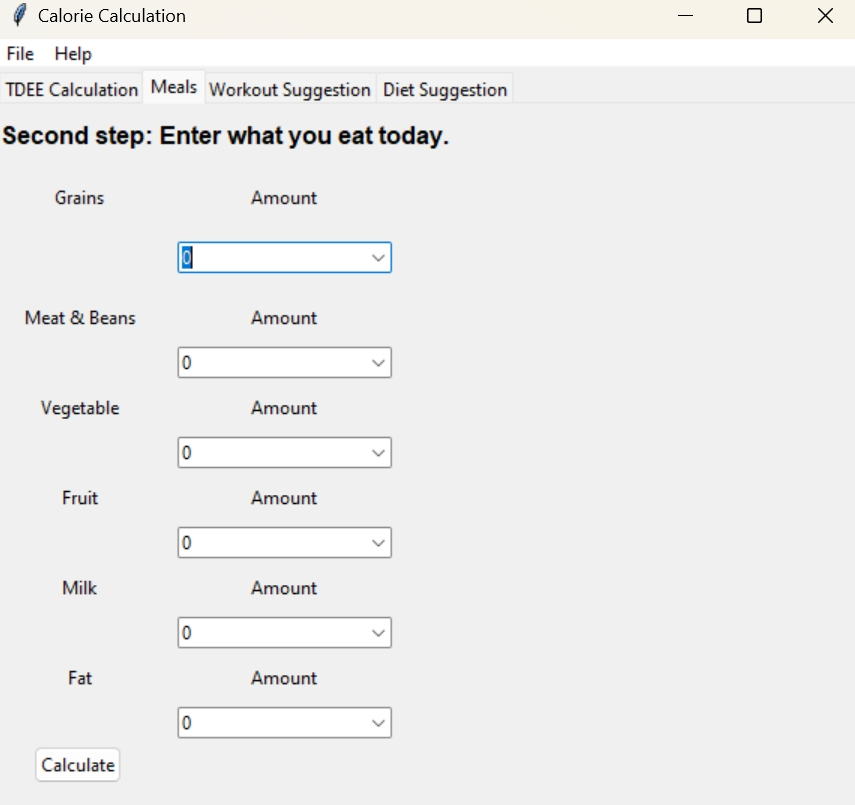
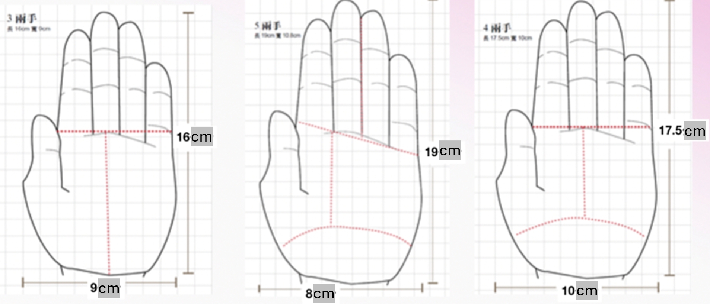

# GUI_with_R

**Project descriptions:**
This is a GUI for calorie calculation and nutritional advice. This project is developed using the library of tcltk, tcltk2 and tkrplot in R. 
All rights reserved for the author publishing this project. 

## Instructions on how to use the app 

After running the R script, a graphical user interface will pop up, which includes four tabs: TDEE Calculation, Meals, Workout Suggestion and Diet Suggestion. 
Please note that Workout Suggestion and Diet Suggestion are still under development. And the instructions for how to use the app are as follows: 

Please fill in the required information in the blanks and hit OK and the app will automatically calculate your TDEE for you according to your diet goal. 

 

Then you can go to the second tab Meals and enter your daily intake of meals. The app will calculate the total calories you take today. 

 

## User Guidelines 

**Part 1: Food amount calculation**

 

- One region means one hectogram (37.5 g in Taiwan) or one serving of food (amount). 

**Part 2: When entering Meals**

1. Same category (There are six categories in the app), same food nutrient composition.

a.	For example, if you eat a bowl of rice and a steamed bun, both contain 280 kcal, then the nutrient composition for both is carbohydrate 60g and protein 8g. 

b.	And if you eat a bowl of rice porridge, which contains 140 kcal, then nutrient composition is carbohydrate 30g and protein 4g. The nutrient composition is half of that of a steamed bun with 280 kcal. 

2. So you can add food with same calorie into same food and double the amount.

3. Or you can calculate in proportion to the calories that the food has and sum up. 
For example, if you eat a bowl of rice porridge (140 kcal) and a steamed bun (280 kcal), then total calorie and nutrient you take equal THREE bowls of rice porridge.

**Part 3: TDEE Calculation**

1. After entering your information and setting the goal (Ex. Lose/Gain Weight/Build Muscles), the app will provide you with your Total Daily Energy Expenditure (TDEE), a measure of how many calories you burn per day. You need to eat more or less than the TDEE to achieve your goal. 

2. You can eat following the suggestion for one week and see if you gain or lose weight. If not, the reason may be that TDEE is an etimated number, which includes some bias. Your TDEE might be slightly higher or lower than the estimation. And the solutions can be:

a.	If your goal is to gain weight: After eating for one week but you still maintain weight, then you can eat more since your actual TDEE might be higher than the estimation.

b.	If your goal is to lose weight: After eating for one week but you still maintain weight, then you can eat less or exercise more. 

3. The suggested actual calories you take every day is set to be +300 or -300 kcal of TDEE according to your goal.

